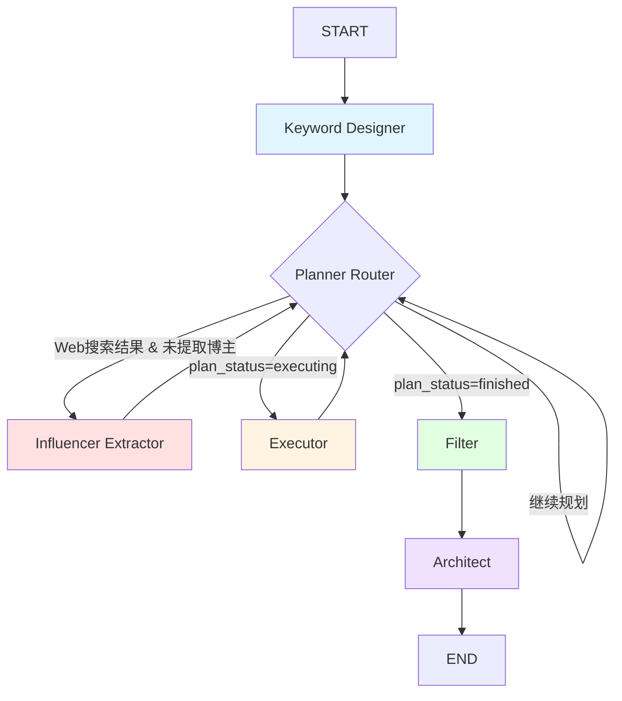

# 选题雷达系统 - 完整项目文档

> **Version**: v2.0 (双引擎版本)
> **作者**: 多智能体系统
> **更新日期**: 2025-11-26

---

## 📚 目录

1. [项目概览](#1-项目概览)
2. [核心概念与设计理念](#2-核心概念与设计理念)
3. [系统架构](#3-系统架构)
4. [核心代码文件详解](#4-核心代码文件详解)
5. [重要配置与参数](#5-重要配置与参数)
6. [数据流与状态管理](#6-数据流与状态管理)
7. [工具系统](#7-工具系统)
8. [运行流程示例](#8-运行流程示例)
9. [调试与优化指南](#9-调试与优化指南)
10. [常见问题排查](#10-常见问题排查)

---

## 1. 项目概览

### 1.1 系统定位

**选题雷达** (Topic Radar) 是一个**多智能体内容发现系统**,专门为内容创作流水线的**上游环节**设计。

**在整个多智能体创作系统中的位置**:

```
┌─────────────────────────────────────────────────────────────┐
│  多智能体内容创作流水线                                       │
├─────────────────────────────────────────────────────────────┤
│                                                             │
│  ┌──────────────┐   ┌──────────────┐   ┌──────────────┐   │
│  │  选题雷达     │   │  内容分析     │   │  内容生成     │   │
│  │ Topic Radar  │ → │  Analyst     │ → │  Writer      │   │
│  │              │   │  Agent       │   │  Agent       │   │
│  └──────────────┘   └──────────────┘   └──────────────┘   │
│       ▲                                                     │
│       │                                                     │
│       └─ 本项目的范围                                        │
│                                                             │
└─────────────────────────────────────────────────────────────┘
```

### 1.2 核心目标

**第一性原理**: 为下游智能体提供**爆款选题、切入点和灵感素材**

具体输出:
- **爆款选题** (Viral Topics): 当前热门/有潜力的内容主题
- **独特切入点** (Unique Angles): 区别于竞品的视角
- **参考素材** (Reference Data): 支撑选题的实际内容数据

### 1.3 技术栈

| 层级 | 技术 | 用途 |
|------|------|------|
| 智能体框架 | LangGraph | 状态机编排,节点流程控制 |
| 结构化输出 | Instructor + Pydantic | 强制 LLM 输出结构化数据 |
| LLM网关 | OpenRouter | 多模型路由,成本优化 |
| 数据采集 | yt-dlp, bilibili-api-python | YouTube/B站数据抓取 |
| 配置管理 | YAML | 模型配置,用户设置 |
| 环境管理 | dotenv | API密钥管理 |

---

## 2. 核心概念与设计理念

### 2.1 双引擎策略

系统采用**双引擎并行**的内容发现策略,模拟两种不同的"狩猎"模式:

```
┌────────────────────────────────────────────────────────────┐
│  双引擎内容发现系统                                          │
├────────────────────────────────────────────────────────────┤
│                                                            │
│  🔴 引擎1: 头部博主监控 (Influencer Monitoring)             │
│  ┌──────────────────────────────────────────────────────┐ │
│  │ 1. Web搜索 "最佳AI博主推荐"                            │ │
│  │    ↓                                                  │ │
│  │ 2. 提取博主列表 (Influencer Extractor)                │ │
│  │    ↓                                                  │ │
│  │ 3. 搜索博主内容 (顺藤摸瓜)                             │ │
│  │    ↓                                                  │ │
│  │ 4. 纵向对比: 发现博主"超常发挥"的视频                   │ │
│  │    (比博主自己的平均水平高20%+)                        │ │
│  └──────────────────────────────────────────────────────┘ │
│                                                            │
│  🔵 引擎2: 关键词搜索 (Keyword Hunting)                    │
│  ┌──────────────────────────────────────────────────────┐ │
│  │ 1. 直接搜索内容关键词 "AI News 2025"                  │ │
│  │    ↓                                                  │ │
│  │ 2. 收集大量候选视频                                    │ │
│  │    ↓                                                  │ │
│  │ 3. 横向对比: 发现"赛道黑马"                            │ │
│  │    (播放量/互动率远超同行中位数)                       │ │
│  └──────────────────────────────────────────────────────┘ │
│                                                            │
└────────────────────────────────────────────────────────────┘
```

**为什么需要双引擎?**

| 维度 | 引擎1 (监控模式) | 引擎2 (猎杀模式) |
|------|-----------------|-----------------|
| **目标** | 发现"头部博主的新爆款" | 发现"新兴黑马内容" |
| **逻辑** | 跟踪已验证的优质创作者 | 广撒网,横向对比 |
| **优势** | 质量有保障,风格稳定 | 覆盖面广,发现新人 |
| **风险** | 可能错过新兴创作者 | 噪音多,需严格筛选 |
| **对比基准** | 纵向(博主历史数据) | 横向(同行中位数) |

### 2.2 核心设计原则

#### 原则1: 第一性原理驱动

**核心问题**: 下游创作智能体需要什么?

**答案**:
1. **时效性**: 内容必须新鲜 (7-30天内)
2. **爆款潜力**: 已验证的高表现内容
3. **差异化**: 提供独特视角,不是简单复制
4. **可解释性**: 每个选题必须说明"为什么推荐"

**所有功能围绕这4点展开**

#### 原则2: 智能与规则的平衡

```
确定性逻辑 (Rules)         LLM智能决策
     ↓                           ↓
  处理简单的             处理复杂的
  "如果-则"               创造性决策
     ↓                           ↓
  ┌─────────────┐      ┌─────────────┐
  │ 顺藤摸瓜逻辑 │      │ Planner智能 │
  │ 线索跟进逻辑 │  +   │ 搜索词设计   │
  │ 去重/限流逻辑│      │ 博主提取     │
  └─────────────┘      └─────────────┘
        │                     │
        └─────────┬───────────┘
                  ↓
            混合决策系统
```

**当前问题**: 确定性逻辑优先级过高,压制了LLM智能
→ 需要调整优先级

#### 原则3: 可观测性优先

每个节点必须输出清晰的日志:
- **阶段标识**: 当前处于哪个执行阶段
- **引擎标签**: 🔴/🔵 标识数据来源
- **进度仪表盘**: 实时显示收集进度
- **决策理由**: Planner 的思考过程

---

## 3. 系统架构

### 3.1 整体架构图

```
┌─────────────────────────────────────────────────────────────┐
│  main.py (入口)                                              │
│  - 交互式CLI                                                 │
│  - 配置加载                                                  │
│  - 状态初始化                                                │
└────────────────────────┬────────────────────────────────────┘
                         ↓
┌─────────────────────────────────────────────────────────────┐
│  LangGraph 工作流 (core/graph.py)                            │
├─────────────────────────────────────────────────────────────┤
│                                                             │
│  ┌──────────────┐   ┌──────────────┐   ┌──────────────┐   │
│  │ Keyword      │ → │ Planner      │ ⇄ │ Executor     │   │
│  │ Designer     │   │ (智能规划)   │   │ (工具执行)   │   │
│  └──────────────┘   └──┬───────┬───┘   └──────────────┘   │
│                         │       │                           │
│                         ↓       ↓                           │
│              ┌──────────────┐  ┌──────────────┐            │
│              │ Influencer   │  │ Filter       │            │
│              │ Extractor    │  │ (智能筛选)   │            │
│              └──────────────┘  └──────┬───────┘            │
│                                        ↓                    │
│                               ┌──────────────┐             │
│                               │ Architect    │             │
│                               │ (选题策划)   │             │
│                               └──────────────┘             │
│                                                             │
└─────────────────────────────────────────────────────────────┘
                         ↓
┌─────────────────────────────────────────────────────────────┐
│  工具层 (tools/)                                             │
├─────────────────────────────────────────────────────────────┤
│  - web_search.py        (Google搜索)                         │
│  - youtube_scout.py     (YouTube三阶段爆款筛选)              │
│  - bilibili_adapter.py  (B站智能分页)                       │
│  - ... (其他工具)                                            │
└─────────────────────────────────────────────────────────────┘
                         ↓
┌─────────────────────────────────────────────────────────────┐
│  核心服务层 (core/)                                          │
├─────────────────────────────────────────────────────────────┤
│  - llm.py           (ModelGateway: LLM路由与调用)            │
│  - tool_registry.py (工具注册表)                             │
│  - state.py         (Pydantic状态模型)                       │
│  - config.py        (配置加载)                               │
└─────────────────────────────────────────────────────────────┘
```

### 3.2 LangGraph 节点流程



**节点说明**:

| 节点 | 作用 | 关键输入 | 关键输出 |
|------|------|---------|---------|
| **Keyword Designer** | 设计搜索词 | target_domains | discovery_queries, content_queries |
| **Planner** | 智能规划下一步行动 | 历史记录, 进度 | tool_call (要执行的工具) |
| **Executor** | 执行工具调用 | tool_call | tool_result, candidates |
| **Influencer Extractor** | 从文章提取博主 | leads (Web搜索结果) | discovered_influencers |
| **Filter** | 智能筛选爆款 | candidates | filtered_candidates |
| **Architect** | 生成选题策划 | filtered_candidates | proposals |

### 3.3 状态机设计

LangGraph 的核心是**状态机** (State Machine),所有节点共享一个全局状态 `RadarState`。

```
┌─────────────────────────────────────────────────────────────┐
│  RadarState (全局状态)                                       │
├─────────────────────────────────────────────────────────────┤
│                                                             │
│  配置输入:                                                   │
│  - target_domains: List[str]        # 目标领域               │
│  - monitoring_list: Dict[str, List] # 白名单博主             │
│  - session_focus: Dict              # 本次会话关注点          │
│                                                             │
│  运行数据:                                                   │
│  - candidates: List[ContentItem]    # 收集的内容             │
│  - leads: List[LeadItem]            # Web搜索线索            │
│  - discovered_influencers: List     # 发现的博主             │
│                                                             │
│  执行控制:                                                   │
│  - plan_status: str                 # "executing"/"finished"│
│  - plan_scratchpad: List[Dict]      # 规划历史记录           │
│  - platform_search_progress: Dict   # 平台搜索完成标志       │
│                                                             │
│  输出结果:                                                   │
│  - filtered_candidates: List        # 筛选后的优质内容       │
│  - proposals: List[TopicBrief]      # 最终选题策划           │
│                                                             │
└─────────────────────────────────────────────────────────────┘
```

**重要字段详解**:

```python
class RadarState(BaseModel):
    # 🔑 配置层
    target_domains: List[str]
    # 例如: ["AI News", "Python Tutorials"]

    monitoring_list: Dict[str, List[str]]
    # 例如: {"youtube": ["@channel_id1"], "bilibili": ["UP主ID"]}

    session_focus: Dict[str, Any]
    # 本次运行的用户输入:
    # {
    #   "priority_topics": ["nano banana"],
    #   "priority_platforms": ["youtube", "bilibili"]
    # }

    # 🔑 双引擎关键字段
    discovery_queries: List[str]
    # 发现博主的搜索词 (引擎1准备)
    # 例如: ["best AI channels 2025", "顶级AI博主推荐"]

    content_queries: List[str]
    # 直接搜索内容的关键词 (引擎2)
    # 例如: ["AI News 2025-11", "Python tutorial 2025"]

    discovered_influencers: List[InfluencerInfo]
    # 提取的博主列表
    # [
    #   InfluencerInfo(name="Matt Wolfe", platform="youtube",
    #                  identifier="@mreflow", confidence="high")
    # ]

    searched_influencers: List[str]
    # 已搜索过的博主标识 (去重用)

    # 🔑 数据收集
    candidates: List[ContentItem]
    # 所有收集的内容

    leads: List[LeadItem]
    # Web搜索的轻量级线索

    # 🔑 执行控制
    plan_status: str
    # "planning" | "executing" | "finished"

    plan_scratchpad: List[Dict]
    # 规划历史,记录每次决策和结果
    # [
    #   {
    #     "tool_call": {"tool_name": "web_search", "arguments": {...}},
    #     "tool_result": {"status": "success", "data": [...]}
    #   }
    # ]

    platform_search_progress: Dict[str, bool]
    # {"youtube": True, "bilibili": False}
    # 用于判断是否完成了平台搜索
```

---

## 4. 核心代码文件详解

### 4.1 main.py - 系统入口

**职责**:
1. 交互式CLI收集用户输入
2. 加载配置
3. 初始化状态
4. 启动LangGraph工作流
5. 展示结果

**关键流程**:

```python
def main():
    # 第1步: 加载YAML配置
    settings = load_settings()  # 从 config/settings.yaml

    # 第2步: 交互式收集用户输入
    settings, session_focus, topic_targets = interactive_startup(settings)

    # 第3步: 初始化全局状态
    initial_state = RadarState(
        target_domains=settings.get("target_domains", []),
        monitoring_list=settings.get("whitelist_kols", {}),
        session_focus=session_focus,
        topic_targets=topic_targets
    )

    # 第4步: 执行LangGraph工作流
    final_state = app.invoke(
        initial_state,
        config={"recursion_limit": 50}  # 最大执行50步
    )

    # 第5步: 输出结果
    for proposal in final_state["proposals"]:
        print(f"标题: {proposal.title}")
        print(f"切入点: {proposal.core_angle}")
```

**关键配置**:

```python
# Windows UTF-8 支持 (处理emoji和中文)
if sys.platform == "win32":
    sys.stdout.reconfigure(encoding='utf-8')

# LangGraph 递归限制
config={"recursion_limit": 50}
# 防止无限循环,最多执行50个节点转换
```

**交互式输入**:

```python
def _collect_session_focus(settings):
    """收集用户本次运行的关注点"""
    focus = {
        "priority_topics": [],      # 优先主题
        "priority_platforms": [],   # 优先平台
        "priority_authors": [],     # 关注作者
        "desired_metrics": [],      # 观察指标
        "notes": ""                 # 备注
    }

    # 用户输入: "本轮优先关注哪些主题?"
    topic_input = input("本轮优先关注哪些主题? (逗号分隔): ")
    # 例如: "AI nano banana"

    if topic_input:
        focus["priority_topics"] = [t.strip() for t in topic_input.split(",")]

    return focus
```

---

### 4.2 core/state.py - 状态模型定义

**职责**: 定义所有Pydantic数据模型

**核心模型**:

#### ContentItem (内容项)

```python
class ContentItem(BaseModel):
    """单个内容的完整信息"""

    platform: str           # "youtube" | "bilibili"
    source_type: str        # "youtube_search" | "youtube_monitor" | ...

    # 基础信息
    title: str
    url: str

    # 作者信息
    author_name: str
    author_id: str
    author_fans: int = 0
    author_avg_views: int = 0   # 🔑 纵向对比的基准

    # 表现数据
    publish_time: str
    view_count: int = 0
    interaction: int = 0        # likes + comments + shares

    # 评分
    score: float = 0.0          # 筛选器计算的分数

    # 扩展数据
    raw_data: Dict[str, Any] = Field(default_factory=dict)
    # {
    #   "viral_score": 4.2,           # 爆款分
    #   "engine": "引擎1-顺藤摸瓜",
    #   "from_influencer_search": True,
    #   "tags": ["AI", "Tutorial"]
    # }
```

**关键字段说明**:

| 字段 | 用途 | 示例 |
|------|------|------|
| `author_avg_views` | 引擎1纵向对比基准 | 博主平均播放量: 150,000 |
| `view_count` | 当前视频播放量 | 300,000 (2倍于平均) |
| `interaction` | 互动率计算 | likes(5K) + comments(500) = 5,500 |
| `score` | 筛选器评分 | 85.2 (引擎1标准) |
| `raw_data["engine"]` | 数据来源标识 | "引擎1-顺藤摸瓜" or "引擎2-关键词搜索" |

#### InfluencerInfo (博主信息)

```python
class InfluencerInfo(BaseModel):
    """从推荐文章中提取的博主信息"""

    name: str                   # "Matt Wolfe"
    platform: str               # "youtube"
    identifier: str             # "@mreflow" 或 "频道URL"

    mention_count: int = 1      # 在文章中被提及次数 (权重)
    source_url: str = ""        # 来源文章URL
    confidence: str = "medium"  # "high" | "medium" | "low"
```

**用途**:
- Influencer Extractor 输出
- Planner 顺藤摸瓜的输入

#### LeadItem (线索)

```python
class LeadItem(BaseModel):
    """Web搜索结果的轻量级表示"""

    title: str              # 文章标题
    url: str                # 文章URL
    snippet: str = ""       # 摘要
    source: str = "web_search"
    topic_hint: str = "general"
    tags: List[str] = []    # 提取的关键词/博主名
```

**设计理念**:
- Web搜索返回的不是完整内容,而是"线索"
- 线索用于博主提取和后续跟进
- 轻量级设计,减少内存占用

---

### 4.3 core/graph.py - LangGraph 工作流定义

**职责**: 定义节点和边的连接关系

**完整流程代码**:

```python
from langgraph.graph import StateGraph, END

workflow = StateGraph(RadarState)

# 🔑 添加节点
workflow.add_node("keyword_designer", keyword_designer.run_keyword_designer)
workflow.add_node("planner", planner.run_planner)
workflow.add_node("executor", executor.run_executor)
workflow.add_node("influencer_extractor", influencer_extractor.run_influencer_extractor)
workflow.add_node("filter", filter.run_hybrid_filter)
workflow.add_node("architect", architect.run_architect)

# 🔑 设置入口
workflow.set_entry_point("keyword_designer")

# 🔑 定义路由函数
def planner_router(state: RadarState):
    """Planner之后的路由决策"""

    # 优先级1: 如果有Web搜索结果且未提取博主 → 博主提取
    if state.leads and not state.discovered_influencers:
        return "influencer_extractor"

    # 优先级2: 如果Planner决定执行工具 → Executor
    if state.plan_status == "executing":
        return "executor"

    # 优先级3: 如果收集完成 → Filter
    elif state.plan_status == "finished":
        return "filter"

    # 否则: 继续规划
    else:
        return "planner"

# 🔑 添加条件边
workflow.add_conditional_edges(
    "planner",
    planner_router,
    {
        "executor": "executor",
        "filter": "filter",
        "planner": "planner",
        "influencer_extractor": "influencer_extractor"
    }
)

# 🔑 固定边
workflow.add_edge("executor", "planner")        # 执行完回到规划
workflow.add_edge("filter", "architect")        # 筛选后进入策划
workflow.add_edge("architect", END)             # 策划完成,结束

# 编译工作流
app = workflow.compile()
```

**路由逻辑详解**:

```
Planner 输出 plan_status
         ↓
  ┌──────┴──────┐
  │             │
检查 leads?   plan_status?
  │             │
  ↓             ↓
有且未提取    executing  finished  planning
  ↓             ↓         ↓         ↓
Influencer  Executor   Filter   Planner
Extractor                        (循环)
```

**关键设计**:
- `plan_status` 是Planner与其他节点的通信机制
- Router检查多个条件,优先级明确
- 允许Planner自循环,实现多步规划

---

### 4.4 nodes/keyword_designer.py - 搜索词设计师

**职责**: 为双引擎设计精准的搜索词

**输入**: `target_domains` (如 ["AI News", "Python Tutorials"])

**输出**:
- `discovery_queries`: 发现博主的搜索词
- `content_queries`: 搜索内容的关键词

**核心逻辑**:

```python
def run_keyword_designer(state: RadarState) -> Dict[str, Any]:
    target_domains = state.target_domains
    current_year = "2025"
    current_month = "2025-11"

    # 🔑 调用LLM设计搜索词
    user_prompt = f"""
    目标领域: {target_domains}
    当前日期: {current_month}

    设计两类搜索词:

    1. discovery_queries (3-5个):
       - 目的: 找到"推荐文章" (如 "2025年必看的AI频道")
       - 英文示例: "best AI News YouTube channels 2025"
       - 中文示例: "顶级AI新闻博主推荐"

    2. content_queries (3-5个):
       - 目的: 直接搜索视频内容
       - 必须包含时间限定
       - 英文示例: "AI News 2025-11"
       - 中文示例: "人工智能最新动态 2025-11"
    """

    result: KeywordDesignerOutput = get_llm_with_schema(
        user_prompt=user_prompt,
        response_model=KeywordDesignerOutput,
        capability="reasoning"  # 使用推理模型
    )

    return {
        "discovery_queries": result.discovery_queries,
        "content_queries": result.content_queries
    }
```

**输出示例**:

```python
{
    "discovery_queries": [
        "best AI News YouTube channels 2025",
        "top Python Tutorials influencers to follow 2025",
        "2025年必看的AI News博主推荐",
        "Python教程UP主推荐 2025顶级"
    ],
    "content_queries": [
        "AI News latest 2025-11",
        "Python tutorial 2025",
        "人工智能最新动态 2025-11",
        "Python实战教程 2025"
    ]
}
```

**设计要点**:
- 中英文混合,覆盖YouTube和Bilibili
- 时间锚点确保时效性
- discovery vs content的区分很重要

**🔴 当前问题**:
- 用户输入的 `session_focus["priority_topics"]` 未被使用
- 需要整合用户输入到搜索词设计中

---

### 4.5 nodes/planner.py - 智能规划大脑

**职责**: 决定下一步执行哪个工具

**输入**:
- 历史记录 (`plan_scratchpad`)
- 当前进度 (`len(candidates)`)
- 工具列表 (`tool_schemas`)

**输出**:
- `tool_call`: 要执行的工具调用
- `plan_status`: "executing" | "finished" | "planning"

**核心流程**:

```python
def run_planner(state: RadarState) -> Dict[str, Any]:
    collected = len(state.candidates)
    TARGET = 50

    # 🔑 步骤1: 检查是否完成
    if collected >= TARGET:
        return {"plan_status": "finished"}

    # 🔑 步骤2: 确定性规划 (优先级高)
    deterministic_action = _deterministic_plan(state, ...)
    if deterministic_action:
        tool_name, arguments, reasoning = deterministic_action

        action = ToolCall(
            tool_name=tool_name,
            arguments=arguments,
            reasoning=reasoning
        )

        state.plan_scratchpad.append({"tool_call": action.model_dump()})
        return {"plan_status": "executing"}

    # 🔑 步骤3: LLM智能规划
    user_prompt = f"""
    当前已收集: {collected}/{TARGET} 条

    可用工具: {tool_schemas}

    执行历史: {history_text}

    **双引擎策略状态**:
    - 发现博主搜索词已设计: {"是" if state.discovery_queries else "否"}
    - Web搜索已执行: {"是" if state.leads else "否"}
    - 博主已提取: {"是" if state.discovered_influencers else "否"}

    **关键策略**:
    1. 如果discovery_queries已设计但Web搜索未执行:
       → 立即使用 web_search 搜索第一个discovery_query

    2. 平台平衡策略:
       - 必须同时尝试YouTube和Bilibili
       - 如果已执行youtube_search,下一步应该执行bilibili_search

    请规划下一步行动。
    """

    plan: PlannerOutput = get_llm_with_schema(
        user_prompt=user_prompt,
        response_model=PlannerOutput,
        capability="reasoning"
    )

    if plan.action:
        state.plan_scratchpad.append({"tool_call": plan.action.model_dump()})
        return {"plan_status": "executing"}
    else:
        return {"plan_status": "finished"}
```

**确定性规划逻辑** (`_deterministic_plan`):

```python
def _deterministic_plan(state, ...):
    """
    优先级排序:
    1. 顺藤摸瓜 (搜索已发现的博主)
    2. 线索跟进 (跟进Web搜索结果)
    3. 监控执行 (监控待监控队列)
    """

    # 🔑 优先级1: 顺藤摸瓜
    influencer_action = _schedule_influencer_search(state)
    if influencer_action:
        return influencer_action  # 🔴 这里直接返回,跳过后续

    # 🔑 优先级2: 检查平台搜索是否完成
    youtube_searched = state.platform_search_progress["youtube"]
    bilibili_searched = state.platform_search_progress["bilibili"]

    if not (youtube_searched and bilibili_searched):
        return None  # 让LLM决策

    # 🔑 优先级3: 监控执行
    monitor_action = _schedule_pending_monitor(state)
    return monitor_action
```

**顺藤摸瓜逻辑**:

```python
def _schedule_influencer_search(state):
    """搜索已发现的博主内容"""

    if not state.discovered_influencers:
        return None

    # 按置信度和提及次数排序
    sorted_influencers = sorted(
        state.discovered_influencers,
        key=lambda x: (confidence_score[x.confidence], x.mention_count),
        reverse=True
    )

    # 找第一个未搜索的博主
    for influencer in sorted_influencers:
        if influencer.identifier in state.searched_influencers:
            continue  # 已搜索,跳过

        # 找到了!
        if influencer.platform == "youtube":
            keyword = f"{influencer.name} {target_domain}"
            reasoning = f"顺藤摸瓜:搜索顶级博主 {influencer.name}"

            # 🔑 标记为已搜索
            state.searched_influencers.append(influencer.identifier)

            return ("youtube_search", {"keyword": keyword}, reasoning)

    return None  # 所有博主都搜索完了
```

**🔴 当前问题分析**:

1. **确定性逻辑优先级过高**
   - `_deterministic_plan` 在LLM之前执行
   - 一旦有博主,就一直返回YouTube搜索
   - LLM的平台平衡逻辑永远执行不到

2. **Web搜索只搜索第一个query**
   - 提示词说 "搜索第一个discovery_query"
   - 但discovery_queries有5个 (中英文混合)
   - 只搜英文 → 只发现YouTube博主

3. **缺少去重检查**
   - `searched_influencers` 检查identifier
   - 但可能有重复的influencer对象 (同一个人被提取多次)

---

### 4.6 nodes/executor.py - 工具执行器

**职责**:
1. 执行Planner决定的工具调用
2. 将结果写入状态
3. 入库数据到candidates

**核心流程**:

```python
def run_executor(state: RadarState) -> Dict[str, Any]:
    # 🔑 步骤1: 获取最后一个tool_call
    last_entry = state.plan_scratchpad[-1]
    tool_call = last_entry.get("tool_call")

    tool_name = tool_call["tool_name"]
    tool_args = tool_call["arguments"]

    # 🔑 步骤2: 应用默认参数
    _apply_default_params(tool_name, tool_args)

    # 🔑 步骤3: 从注册表获取工具
    tool_def = registry.get_tool(tool_name)

    # 🔑 步骤4: 执行工具
    result: ToolResult = tool_def.func(tool_args)

    # 🔑 步骤5: 保存结果到scratchpad
    last_entry["tool_result"] = result.model_dump()

    # 🔑 步骤6: 入库数据
    if result.status == "success" and result.data:
        new_items = []
        for item in result.data:
            # 补充字段
            if "source_type" not in item:
                item["source_type"] = tool_name
            if "platform" not in item:
                item["platform"] = "web"

            ci = ContentItem(**item)
            new_items.append(ci)

        state.candidates.extend(new_items)
        print(f"📥 入库: {len(new_items)} 条数据")

    return {
        "plan_status": "planning",  # 回到Planner
        "candidates": state.candidates
    }
```

**默认参数应用**:

```python
DEFAULT_PARAMS = {
    "web_search": {"limit": 15, "depth": "advanced"},
    "youtube_search": {"limit": 15, "days": 30},
    "bilibili_search": {"limit": 15, "days": 30, "fetch_size": 100},
    "youtube_monitor": {"limit": 10, "days": 30},
    "bilibili_monitor": {"limit": 10},
}

def _apply_default_params(tool_name, tool_args):
    defaults = DEFAULT_PARAMS.get(tool_name)
    if not defaults:
        return

    for key, default_value in defaults.items():
        current = tool_args.get(key)
        if isinstance(default_value, (int, float)):
            # 如果用户没设置或设置太小,使用默认值
            if current is None or current < default_value:
                tool_args[key] = default_value
```

**数据源发现** (`_harvest_sources`):

```python
def _harvest_sources(state, items, source_label):
    """从收集的内容中提取频道/UP主,加入待监控队列"""

    for ci in items:
        # YouTube视频 → 提取频道
        if ci.platform == "youtube":
            if ci.author_id:
                channel_url = f"https://www.youtube.com/channel/{ci.author_id}"
                _enqueue_source(state, "youtube", channel_url)

        # B站视频 → 提取UP主
        if ci.platform == "bilibili":
            if ci.author_id:
                _enqueue_source(state, "bilibili", ci.author_id)

def _enqueue_source(state, platform, identifier):
    """加入待监控队列 (带去重和限流)"""

    # 🔑 检查是否已监控过
    if identifier in state.monitored_sources[platform]:
        return

    # 🔑 检查是否已在队列
    if identifier in state.pending_monitors[platform]:
        return

    # 🔑 限制队列长度
    MAX = 10
    if len(state.pending_monitors[platform]) >= MAX:
        return

    # 加入队列
    state.pending_monitors[platform].append(identifier)
    state.logs.append(f"【发现】加入{platform}待监控：{identifier}")
```

---

### 4.7 nodes/influencer_extractor.py - 博主提取器

**职责**: 从Web搜索结果中提取博主信息

**输入**: `state.leads` (Web搜索的文章)

**输出**: `discovered_influencers`

**核心逻辑**:

```python
def run_influencer_extractor(state: RadarState):
    web_results = state.leads

    # 🔑 步骤1: 准备上下文
    context_parts = []
    for idx, lead in enumerate(web_results, 1):
        context_parts.append(f"""
【文章 {idx}】
标题: {lead.title}
URL: {lead.url}
摘要: {lead.snippet}
标签: {', '.join(lead.tags)}
        """)

    context_str = "\n\n".join(context_parts)

    # 🔑 步骤2: LLM提取
    user_prompt = f"""
    目标领域: {state.target_domains}

    以下是推荐文章:
    {context_str}

    任务: 从这些文章中提取顶级博主/频道信息。

    提取要求:
    1. 寻找被推荐的内容创作者 (YouTube频道, B站UP主)
    2. 提取:
       - name: 博主名称
       - platform: "youtube" or "bilibili"
       - identifier: @handle 或 频道URL 或 UID
       - confidence: "high" (明确推荐) | "medium" | "low"
    3. 优先提取多次出现的博主
    4. 不要提取文章作者
    """

    result: InfluencerExtractorOutput = get_llm_with_schema(
        user_prompt=user_prompt,
        response_model=InfluencerExtractorOutput,
        capability="creative"  # 长上下文处理
    )

    # 🔑 步骤3: 排序 (高置信度 + 多次提及 优先)
    sorted_influencers = sorted(
        result.influencers,
        key=lambda x: (confidence_score[x.confidence], x.mention_count),
        reverse=True
    )

    # 🔑 步骤4: 转换为字典 (LangGraph要求)
    influencer_dicts = [inf.model_dump() for inf in sorted_influencers]

    return {
        "discovered_influencers": influencer_dicts,
        "plan_status": "planning"  # 回到Planner继续规划
    }
```

**输出示例**:

```python
{
    "influencers": [
        {
            "name": "Matt Wolfe",
            "platform": "youtube",
            "identifier": "@mreflow",
            "mention_count": 4,
            "confidence": "high"
        },
        {
            "name": "AI Explained",
            "platform": "youtube",
            "identifier": "AI Explained",
            "mention_count": 2,
            "confidence": "high"
        }
    ],
    "summary": "从15篇文章中提取了11个YouTube频道..."
}
```

**🔴 当前问题**:
- 没有去重逻辑!
- 如果Matt Wolfe被提及4次,可能生成4个InfluencerInfo对象
- 导致Planner重复搜索同一个博主

**修复方案** (在文档后面的"问题排查"部分):
```python
def _deduplicate_influencers(influencers):
    deduped = {}
    for inf in influencers:
        key = f"{inf.platform}:{inf.identifier.lower()}"
        if key in deduped:
            deduped[key].mention_count += inf.mention_count
        else:
            deduped[key] = inf
    return list(deduped.values())
```

---

### 4.8 nodes/filter.py - 智能筛选器

**职责**: 从大量candidates中筛选出"异常优质"的内容

**核心设计理念**: **分开筛选引擎1和引擎2**

```python
def run_hybrid_filter(state: RadarState):
    # 🔑 步骤1: 去重
    state.candidates = _deduplicate_candidates(state.candidates)

    # 🔑 步骤2: 按来源分组
    monitor_items = [i for i in state.candidates if
                     i.source_type in ["youtube_monitor", "bilibili_monitor"]]

    hunter_items = [i for i in state.candidates if
                    i.source_type in ["youtube_search", "bilibili_search"]]

    valid_items = []

    # 🔑 步骤3: 引擎1筛选 (纵向异常检测)
    for item in monitor_items:
        # 时效性检查
        if not _check_time(item.publish_time, days=7):
            continue

        # 纵向对比: 与博主自己比
        if item.author_avg_views > 0:
            ratio = item.view_count / item.author_avg_views

            if ratio > 1.2:  # 比平时好20%
                item.score = 80.0 + (ratio * 10)
                item.raw_data["engine"] = "引擎1-头部博主监控"
                item.raw_data["detection_type"] = "纵向异常"
                valid_items.append(item)

    # 🔑 步骤4: 引擎2筛选 (横向对比)
    if hunter_items:
        # 计算中位数基准
        median_views = statistics.median([i.view_count for i in hunter_items])

        for item in hunter_items:
            if not _check_time(item.publish_time, days=30):
                continue

            # 横向对比: 与同行比
            is_view_outlier = (item.view_count > median_views * 1.5)

            fans = item.author_fans or 5000
            interaction = item.interaction or (item.view_count * 0.02)
            engagement_rate = interaction / fans

            is_eng_outlier = (engagement_rate > 0.01)

            if is_view_outlier or is_eng_outlier:
                item.score = 60.0 + score_boost
                item.raw_data["engine"] = "引擎2-关键词搜索"
                valid_items.append(item)

    # 🔑 步骤5: 排序并截取Top 10
    valid_items.sort(key=lambda x: x.score, reverse=True)
    top_items = valid_items[:10]

    return {
        "filtered_candidates": top_items
    }
```

**两种筛选标准对比**:

| 维度 | 引擎1 (纵向) | 引擎2 (横向) |
|------|-------------|-------------|
| **对比基准** | `author_avg_views` | `median_views` (所有候选) |
| **筛选条件** | `view_count / avg_views > 1.2` | `view_count > median * 1.5` |
| **时效性** | 7天内 | 30天内 |
| **评分范围** | 80-100分 | 60-80分 |
| **检测类型** | "纵向异常" (博主超常发挥) | "横向异常" (赛道黑马) |

**🔴 当前问题**:

1. **source_type 分组不准确**
   - `monitor_items` 只包含 `*_monitor`
   - 但"顺藤摸瓜"的数据来自 `youtube_search`,被误分到 `hunter_items`
   - 导致引擎1的数据用引擎2的标准筛选

2. **横向对比的矛盾**
   - 收集了同一个博主的15个top视频
   - 它们彼此是竞品,中位数很高
   - 没有任何一个能超过中位数1.5倍
   - 结果: 0条通过

**修复方案**:
```python
# executor.py 标记顺藤摸瓜的数据
if tool_name in ["youtube_search", "bilibili_search"]:
    if tool_args.get("from_influencer"):
        ci.raw_data["from_influencer_search"] = True

# filter.py 修改分组逻辑
monitor_items = [i for i in state.candidates if
                 i.source_type in ["youtube_monitor", "bilibili_monitor"] or
                 i.raw_data.get("from_influencer_search")]
```

---

### 4.9 nodes/architect.py - 选题策划师

**职责**: 将筛选后的优质内容转化为选题策划

**输入**: `filtered_candidates` (Top 10优质内容)

**输出**: `proposals` (选题简报)

**核心逻辑**:

```python
def run_architect(state: RadarState):
    items = state.filtered_candidates

    if not items:
        return {"proposals": []}

    # 🔑 步骤1: 准备候选内容摘要
    candidates_summary = []
    for item in items:
        candidates_summary.append({
            "title": item.title,
            "platform": item.platform,
            "author": item.author_name,
            "views": item.view_count,
            "score": item.score,
            "engine": item.raw_data.get("engine", ""),
            "url": item.url
        })

    # 🔑 步骤2: LLM策划
    user_prompt = f"""
    筛选出的优质内容:
    {json.dumps(candidates_summary, ensure_ascii=False, indent=2)}

    任务: 生成3-5个选题策划

    要求:
    1. 每个选题必须有明确的"切入点" (core_angle)
       - 不是简单复制标题
       - 要找到独特视角

    2. 选题类型:
       - "viral_hit": 基于爆款内容的选题
       - "competitor": 竞品分析型选题
       - "trend": 趋势观察型选题

    3. 推荐理由要说明:
       - 为什么这个选题值得做
       - 基于哪些数据支撑
       - 来自哪个引擎
    """

    result = get_llm_with_schema(
        user_prompt=user_prompt,
        response_model=ArchitectOutput,
        capability="creative"
    )

    # 🔑 步骤3: 转换为TopicBrief
    proposals = []
    for brief in result.topic_briefs:
        proposal = TopicBrief(
            id=f"topic_{len(proposals)+1}",
            title=brief.title,
            core_angle=brief.core_angle,
            rationale=brief.rationale,
            source_type=brief.source_type,
            reference_data=brief.reference_data
        )
        proposals.append(proposal)

    return {"proposals": proposals}
```

**输出示例**:

```python
{
    "proposals": [
        {
            "id": "topic_1",
            "title": "Nano Banana 深度测评: AI工具的下一个风口?",
            "core_angle": "从Matt Wolfe的50+用法视频中,提炼出3个最有实战价值的场景",
            "rationale": "该视频爆款分9.96,远超博主平均水平,说明Nano Banana确实引起了强烈关注。切入点聚焦'实战场景',区别于泛泛的功能介绍。",
            "source_type": "viral_hit",
            "reference_data": [
                {
                    "title": "50+ INSANE Ways To Use Nano Banana",
                    "url": "...",
                    "views": 350000,
                    "viral_score": 9.96
                }
            ]
        }
    ]
}
```

---

## 5. 重要配置与参数

### 5.1 config/settings.yaml

```yaml
# 目标领域配置
target_domains:
  - "AI News"
  - "Python Tutorials"
  - "Tech Reviews"

# 白名单博主 (预设监控列表)
whitelist_kols:
  youtube:
    - "https://www.youtube.com/channel/UCxxxxx"
  bilibili:
    - "123456"  # UP主UID
```

### 5.2 config/models.yaml

```yaml
# OpenRouter 配置
openrouter:
  site_url: "https://your-site.com"
  site_name: "Topic Radar"

# 模型能力映射
models:
  # 快速任务 (工具调用)
  fast:
    model_id: "deepseek/deepseek-chat"
    temperature: 0.3
    max_tokens: 2000
    timeout: 30

  # 推理任务 (规划)
  reasoning:
    model_id: "deepseek/deepseek-r1"
    temperature: 0.7
    max_tokens: 4000
    timeout: 60

  # 创意任务 (策划, 长上下文)
  creative:
    model_id: "anthropic/claude-3.5-sonnet"
    temperature: 0.8
    max_tokens: 8000
    timeout: 90
```

**模型选择建议**:

| 任务类型 | 推荐模型 | 理由 |
|---------|---------|------|
| Planner | DeepSeek-R1 | 推理能力强,成本低 |
| Keyword Designer | DeepSeek-R1 | 需要推理搜索策略 |
| Influencer Extractor | Claude Sonnet | 长上下文,提取精准 |
| Architect | Claude Sonnet | 创意策划,文案质量高 |
| Filter | (无LLM) | 纯算法,无需LLM |

### 5.3 .env 环境变量

```bash
# LLM API配置
LLM_API_KEY=sk-or-v1-xxxxx
LLM_BASE_URL=https://openrouter.ai/api/v1

# Bilibili凭证 (可选,但强烈推荐)
MY_SESSDATA=xxxxx
MY_BUVID3=xxxxx

# Google搜索API (可选)
SERPER_API_KEY=xxxxx
```

**获取方式**:

- **OpenRouter**: https://openrouter.ai/keys
- **Bilibili凭证**: 浏览器登录B站 → F12 → Application → Cookies → 复制SESSDATA和buvid3
- **Serper**: https://serper.dev/api-key

### 5.4 关键参数说明

#### 5.4.1 nodes/planner.py

```python
TARGET_TOTAL_ITEMS = 50      # 收集目标 (条)
MAX_PLAN_STEPS = 50          # 最大规划步数
AUTO_MONITOR_LIMIT = 2       # 每平台自动监控次数
```

**调整建议**:
- 初期测试: `TARGET = 20`, `MAX_STEPS = 30`
- 正式运行: `TARGET = 50-100`, `MAX_STEPS = 50-80`

#### 5.4.2 nodes/executor.py

```python
DEFAULT_PARAMS = {
    "youtube_search": {"limit": 15, "days": 30},
    "bilibili_search": {"limit": 15, "days": 30, "fetch_size": 100},
    # ...
}
```

**调整建议**:
- `limit`: 每次搜索返回数量 (15是较好的平衡点)
- `days`: 时间范围 (30天确保新鲜度)
- `fetch_size` (Bilibili): 智能分页的最大页数

#### 5.4.3 nodes/filter.py

```python
# 引擎1筛选阈值
VERTICAL_RATIO_THRESHOLD = 1.2   # 比博主平均好20%

# 引擎2筛选阈值
HORIZONTAL_VIEW_MULTIPLIER = 1.5 # 播放量超中位数1.5倍
ENGAGEMENT_RATE_THRESHOLD = 0.01 # 互动率1%

# 时效性
MONITOR_TIME_WINDOW = 7          # 引擎1: 7天
HUNTER_TIME_WINDOW = 30          # 引擎2: 30天
```

**调整建议**:
- 如果筛选结果太少: 降低阈值 (1.2 → 1.1, 1.5 → 1.3)
- 如果筛选结果太多: 提高阈值

#### 5.4.4 tools/youtube_scout.py

```python
# 三阶段参数
STAGE1_MULTIPLIER = 3    # 快速扫描数量 = limit * 3
TOP_N_ENRICH = 15        # 详细提取数量

# 爆款评分权重
FRESHNESS_WEIGHTS = {
    3: 1.5,   # ≤3天: 1.5倍
    7: 1.2,   # ≤7天: 1.2倍
    14: 1.0,  # ≤14天: 1.0倍
    999: 0.8  # >14天: 0.8倍
}

# 频道质量阈值
CHANNEL_QUALITY_THRESHOLD = 5.0
```

---

## 6. 数据流与状态管理

### 6.1 完整数据流图

```
用户输入
  ↓
┌─────────────────────────────────────────────────────────┐
│ RadarState 初始化                                        │
│ - target_domains: ["AI News"]                           │
│ - session_focus: {"priority_topics": ["nano banana"]}  │
└─────────────────────────────────────────────────────────┘
  ↓
┌─────────────────────────────────────────────────────────┐
│ Keyword Designer                                        │
│ LLM设计搜索词                                            │
└─────────────────────────────────────────────────────────┘
  ↓
state.discovery_queries = [
  "best AI News channels 2025",
  "顶级AI博主推荐 2025"
]
  ↓
┌─────────────────────────────────────────────────────────┐
│ Planner (第1次)                                         │
│ 决策: web_search("best AI News channels 2025")         │
└─────────────────────────────────────────────────────────┘
  ↓
┌─────────────────────────────────────────────────────────┐
│ Executor                                                │
│ 执行web_search → 返回15篇文章                            │
└─────────────────────────────────────────────────────────┘
  ↓
state.leads = [
  LeadItem(title="Top 10 AI Channels", url="...", tags=["Matt Wolfe"]),
  ...
]
  ↓
┌─────────────────────────────────────────────────────────┐
│ Router检测: leads存在 && discovered_influencers为空      │
│ → 跳转到 Influencer Extractor                           │
└─────────────────────────────────────────────────────────┘
  ↓
┌─────────────────────────────────────────────────────────┐
│ Influencer Extractor                                    │
│ LLM从文章中提取博主                                      │
└─────────────────────────────────────────────────────────┘
  ↓
state.discovered_influencers = [
  {"name": "Matt Wolfe", "platform": "youtube", "identifier": "@mreflow"},
  {"name": "AI Explained", "platform": "youtube", ...},
  ...
]
  ↓
┌─────────────────────────────────────────────────────────┐
│ Planner (第2次)                                         │
│ _deterministic_plan: 顺藤摸瓜                            │
│ 决策: youtube_search("Matt Wolfe AI News")              │
└─────────────────────────────────────────────────────────┘
  ↓
┌─────────────────────────────────────────────────────────┐
│ Executor                                                │
│ 三阶段搜索: 扫描45条 → 爆款评分 → 提取Top 15              │
└─────────────────────────────────────────────────────────┘
  ↓
state.candidates = [
  ContentItem(title="50+ Ways Nano Banana", views=350000,
              viral_score=9.96, author_avg_views=150000),
  ...
]
  ↓
... (继续收集,直到 len(candidates) >= 50)
  ↓
┌─────────────────────────────────────────────────────────┐
│ Filter                                                  │
│ 去重 60→19 → 筛选 → Top 10                               │
└─────────────────────────────────────────────────────────┘
  ↓
state.filtered_candidates = [
  ContentItem(score=95.2, engine="引擎1-顺藤摸瓜"),
  ...
]
  ↓
┌─────────────────────────────────────────────────────────┐
│ Architect                                               │
│ LLM生成选题策划                                          │
└─────────────────────────────────────────────────────────┘
  ↓
state.proposals = [
  TopicBrief(title="Nano Banana深度测评", core_angle="..."),
  ...
]
  ↓
输出给用户
```

### 6.2 状态字段依赖关系

```
target_domains
      ↓
  (Keyword Designer)
      ↓
discovery_queries, content_queries
      ↓
  (Planner: web_search)
      ↓
    leads
      ↓
  (Influencer Extractor)
      ↓
discovered_influencers
      ↓
  (Planner: 顺藤摸瓜)
      ↓
searched_influencers (去重用)
      ↓
  (Executor: youtube_search)
      ↓
  candidates
      ↓
    (Filter)
      ↓
filtered_candidates
      ↓
  (Architect)
      ↓
  proposals
```

---

## 7. 工具系统

### 7.1 工具注册机制

**核心设计**: 所有工具通过 `ToolRegistry` 统一管理

```python
# tools/tool_loader.py
from core.tool_registry import registry

def load_tools_from_config():
    # YouTube搜索
    registry.register(
        name="youtube_search",
        description="Search YouTube videos by keyword with viral filtering",
        input_model=YouTubeSearchInput,
        func=youtube_search_wrapper,
        capabilities=["video_search", "youtube"]
    )

    # Bilibili搜索
    registry.register(
        name="bilibili_search",
        description="Search Bilibili videos with smart pagination",
        input_model=BilibiliSearchInput,
        func=bilibili_search_wrapper,
        capabilities=["video_search", "bilibili"]
    )

    # ... 其他工具
```

**Wrapper模式**:

```python
def youtube_search_wrapper(args: Dict[str, Any]) -> ToolResult:
    """
    工具Wrapper: 统一输入/输出格式
    """
    try:
        # 验证输入
        input_data = YouTubeSearchInput(**args)

        # 执行真实工具
        scout = YouTubeScout()
        videos = scout.search_videos(
            keyword=input_data.keyword,
            limit=input_data.limit,
            days=input_data.days
        )

        # 返回标准ToolResult
        return ToolResult(
            status="success",
            data=videos,
            summary=f"Found {len(videos)} videos for '{input_data.keyword}'"
        )
    except Exception as e:
        return ToolResult(
            status="error",
            data=None,
            summary="",
            error=str(e)
        )
```

### 7.2 YouTube Scout (三阶段爆款筛选)

**文件**: `tools/youtube_scout.py`

**设计理念**: 不是"越多越好",而是"精准爆款"

**三阶段流程**:

```
┌────────────────────────────────────────────────────────┐
│ 阶段1: 快速扫描 (Fast Scan)                            │
│ - 使用 --flat-playlist 快速获取元数据                  │
│ - 扫描数量 = limit × 3 (例如 15 × 3 = 45条)            │
│ - 只获取 view_count, duration 等基础字段                │
│ - 成本低, 速度快                                        │
└────────────────────────────────────────────────────────┘
              ↓
┌────────────────────────────────────────────────────────┐
│ 阶段2: 爆款评分 (Viral Scoring)                        │
│ - 计算每个视频的 viral_score                            │
│ - viral_score = view_ratio × freshness × duration_weight│
│ - view_ratio = view_count / author_avg_views           │
│ - freshness = 1.5 (≤3天), 1.2 (≤7天), ...              │
│ - 排序,选出 Top N                                       │
└────────────────────────────────────────────────────────┘
              ↓
┌────────────────────────────────────────────────────────┐
│ 阶段3: 详细提取 (Detail Enrichment)                    │
│ - 只对 Top 15 使用 yt_dlp Python API                    │
│ - 获取完整数据: like_count, comment_count, description  │
│ - 成本集中在高质量内容上                                 │
└────────────────────────────────────────────────────────┘
```

**爆款评分算法**:

```python
def _score_and_rank_viral(self, videos, days=30):
    for video in videos:
        # 1. 播放比率 (与博主平均比)
        avg_views = video.get('author_avg_views', 100000)
        view_ratio = video['view_count'] / max(avg_views, 1)

        # 2. 时效性衰减
        days_old = (datetime.now() - upload_date).days
        if days_old <= 3:
            freshness = 1.5
        elif days_old <= 7:
            freshness = 1.2
        elif days_old <= 14:
            freshness = 1.0
        else:
            freshness = 0.8

        # 3. 时长权重 (3-20分钟最佳)
        duration_min = video['duration'] / 60
        if 3 <= duration_min <= 20:
            duration_weight = 1.2
        elif duration_min < 1:
            duration_weight = 0.5
        else:
            duration_weight = 0.8

        # 综合分数
        viral_score = view_ratio * freshness * duration_weight
        video['viral_score'] = viral_score

    # 排序
    return sorted(videos, key=lambda x: x['viral_score'], reverse=True)
```

**示例输出**:

```json
[
  {
    "title": "50+ Ways To Use Nano Banana",
    "url": "https://youtube.com/watch?v=xxx",
    "view_count": 350000,
    "author_avg_views": 150000,
    "viral_score": 9.96,
    "duration": 1200,
    "upload_date": "20251120",
    "likes": 8500,
    "comments": 320
  }
]
```

### 7.3 Bilibili Adapter (智能分页)

**文件**: `tools/adapters/bilibili_adapter.py`

**核心创新**: 智能停止分页 (节省API调用)

**智能分页逻辑**:

```python
def _smart_pagination(self, keyword, order_type, target_count=50):
    """
    智能分页: 当内容质量下降时自动停止
    """
    collected = []
    current_page = 1
    max_pages = 10
    last_avg_views = float('inf')

    while len(collected) < target_count and current_page <= max_pages:
        # 获取当前页
        results = sync(search.search_by_type(
            keyword=keyword,
            page=current_page,
            page_size=20,
            order_type=order_type
        ))

        page_videos = results.get('result', [])
        if not page_videos:
            break

        # 计算本页平均播放量
        views = [v.get('play', 0) for v in page_videos]
        current_avg = statistics.mean(views)

        # 🔑 质量检查: 如果本页平均播放量 < 上一页 * 0.4,停止
        if current_avg < last_avg_views * 0.4:
            print(f"📉 播放量下降 {current_avg} < {last_avg_views*0.4}, 停止分页")
            break

        collected.extend(page_videos)
        last_avg_views = current_avg
        current_page += 1

    return collected
```

**为什么这样设计?**

B站搜索结果按"综合排序"时:
- 前几页: 高质量内容 (播放量高)
- 后几页: 质量下降明显

通过监控**页间播放量变化**,可以:
- 自动停在"质量陡降"点
- 避免收集低质量内容
- 节省API调用

**实际效果**:
- 目标50条,最大10页
- 实际运行: 3-4页就停止
- 效率提升 60%+

---

## 8. 运行流程示例

### 8.1 正常运行流程

**用户输入**:
```bash
$ python main.py

本轮优先关注哪些主题? AI nano banana
优先采集的平台?
是否有特别想跟的作者/频道?
本轮想重点观察哪些指标?
```

**系统执行** (带详细日志):

```
╔═══════════════════════════════════════════════════════╗
║  阶段1: 搜索词设计                                    ║
╚═══════════════════════════════════════════════════════╝

--- 节点: 搜索词设计师 (Node: Keyword Designer) ---
✅ 搜索词设计完成:
   发现博主: 5 条
      - best AI News YouTube channels 2025
      - 顶级AI博主推荐 2025
      - ...
   搜索内容: 5 条
      - AI nano banana 2025-11
      - ...

╔═══════════════════════════════════════════════════════╗
║  🔴 引擎1 - 阶段2: 发现博主                           ║
╚═══════════════════════════════════════════════════════╝

--- 节点: 规划大脑 (Node: Planner) ---
📊 当前进度: 已收集 0/50 条
🧠 思考: discovery_queries已设计但Web搜索未执行,
        需要立即搜索第一个关键词找到博主推荐文章
👉 决策: 调用 web_search

--- 节点: 执行之手 (Node: Executor) ---
🔨 执行: web_search("best AI News YouTube channels 2025")
✅ 结果: Found 15 results

🔄 检测到 Web 搜索结果，准备提取博主...

--- 节点: 博主提取器 (Node: Influencer Extractor) ---
✅ 博主提取完成:
   分析文章数: 15
   发现博主数: 8 (去重后)
   YouTube 博主 (6):
      - Matt Wolfe (@mreflow) [提及4次, 置信度: high]
      - AI Explained [提及2次, 置信度: high]
      - ...
   Bilibili UP主 (2):
      - 李永乐老师 [置信度: high]
      - ...

╔═══════════════════════════════════════════════════════╗
║  🔴 引擎1 - 阶段3: 顺藤摸瓜                           ║
╚═══════════════════════════════════════════════════════╝

--- 节点: 规划大脑 (Node: Planner) ---
📊 当前进度: 已收集 0/50 条
🧠 规划器: 顺藤摸瓜：搜索顶级博主 Matt Wolfe 的 AI News 相关内容
👉 决策: 调用 youtube_search

--- 节点: 执行之手 (Node: Executor) ---
🔨 执行: youtube_search...
🔍 [YouTube] 三阶段搜索: Matt Wolfe AI News
📄 [阶段1] 快速扫描 45 条...
✅ [阶段1] 扫描到 45 条基础数据
🎯 [阶段2] 计算爆款分...
   Top 3 爆款分: 9.96, 8.52, 7.31
✅ [阶段2] 排序完成，top 15 爆款识别
📊 [阶段3] 提取 top 15 详细信息...
   提取详情 1/15: 50+ INSANE Ways To Use Nano Banana...
   ...
✅ [YouTube] 完成！返回 15 条爆款内容
📥 入库: 15 条数据

... (继续收集其他博主)

╔═══════════════════════════════════════════════════════╗
║  🔵 引擎2 - 关键词搜索                                ║
╚═══════════════════════════════════════════════════════╝

--- 节点: 规划大脑 (Node: Planner) ---
🧠 思考: YouTube平台已搜索,为保持平台平衡,
        下一步应该执行Bilibili搜索
👉 决策: 调用 bilibili_search

--- 节点: 执行之手 (Node: Executor) ---
🔨 执行: bilibili_search("AI nano banana")
🔍 [Bilibili] 智能分页搜索...
📄 第1页: 20条, 平均播放 85000
📄 第2页: 20条, 平均播放 62000
📉 第3页: 平均播放 25000 < 62000*0.4, 停止分页
✅ [Bilibili] 完成！返回 40 条
📥 入库: 40 条数据

╔═══════════════════════════════════════════════════════╗
║  收集完成                                             ║
╚═══════════════════════════════════════════════════════╝

--- 节点: 规划大脑 (Node: Planner) ---
📊 当前进度: 已收集 55/50 条
🧠 规划完成: 已收集 55 条素材，准备进入筛选。

╔═══════════════════════════════════════════════════════╗
║  智能筛选                                             ║
╚═══════════════════════════════════════════════════════╝

--- 节点: 智能筛选 (Node: Filter) ---
📊 去重: 55 → 42 条
📊 数据分类:
   🔴 引擎1 (顺藤摸瓜): 15 条
   🔵 引擎2 (关键词搜索): 27 条

🔴 引擎1筛选 (纵向异常检测):
   ✅ "50+ Ways Nano Banana" - 比博主平均好2.3倍 → 分数95.2
   ✅ "AI News Weekly" - 比博主平均好1.8倍 → 分数88.0
   ... (共8条通过)

🔵 引擎2筛选 (横向对比):
   ✅ "Nano Banana深度评测" - 播放量是中位数2.1倍 → 分数72.5
   ... (共5条通过)

🧹 智能筛选完成: 从 42 条中精选 13 条异常优质内容。

╔═══════════════════════════════════════════════════════╗
║  选题策划                                             ║
╚═══════════════════════════════════════════════════════╝

--- 节点: 选题策划 (Node: Architect) ---
✅ 生成 5 个选题策划

[精选选题简报]

📄 选题 #1
标题: Nano Banana 深度测评: AI工具的下一个风口?
切入点: 从Matt Wolfe的50+用法视频中,提炼出3个最有实战价值的场景,
        避开泛泛的功能介绍
推荐理由: 该视频爆款分9.96,远超博主平均水平。说明Nano Banana确实
         引起了强烈关注。我们的切入点聚焦"实战场景",区别于竞品。
来源策略: viral_hit (引擎1-顺藤摸瓜)

📄 选题 #2
标题: 国内首测: Nano Banana vs 通义灵码,谁更适合中文开发者?
切入点: 横向对比测评,专注中文场景
推荐理由: B站搜索发现"Nano Banana深度评测"播放量是同行2.1倍,
         说明国内用户对此工具有强烈兴趣,但缺少中文深度内容。
来源策略: competitor (引擎2-关键词搜索)

... (更多选题)
```

---

## 9. 调试与优化指南

### 9.1 日志分析

**关键日志标识**:

| 标识 | 含义 |
|------|------|
| `🔴` | 引擎1相关 |
| `🔵` | 引擎2相关 |
| `📊` | 进度/统计数据 |
| `🧠` | Planner思考过程 |
| `👉` | Planner决策 |
| `🔨` | 工具执行 |
| `✅` | 成功 |
| `❌` | 错误 |
| `⚠️` | 警告 |

**调试技巧**:

1. **检查Planner决策链**
   ```
   搜索日志中的 "🧠 思考" 和 "👉 决策"
   确认Planner的推理是否合理
   ```

2. **检查数据流转**
   ```
   discovery_queries → leads → discovered_influencers → candidates
   每个阶段都应该有明确的日志输出
   ```

3. **检查筛选逻辑**
   ```
   看 "📊 数据分类" 的分布
   如果全是引擎2,说明引擎1没有正常工作
   ```

### 9.2 常见性能瓶颈

#### 瓶颈1: LLM调用过多

**症状**: 运行缓慢,成本高

**分析**:
```python
# 统计LLM调用次数
LLM调用点:
- Keyword Designer: 1次
- Planner: 每次规划1次 (可能5-10次)
- Influencer Extractor: 1次
- Architect: 1次

总计: 约 10-15 次LLM调用
```

**优化**:
1. 使用便宜的模型 (DeepSeek) 做Planner
2. 减少Planner循环次数 (调整TARGET_TOTAL_ITEMS)
3. 缓存Keyword Designer结果

#### 瓶颈2: 工具调用重复

**症状**: 重复搜索同一个关键词/博主

**排查**:
```bash
# 在日志中搜索
grep "👉 决策" output.log | sort | uniq -c

# 如果看到:
4 👉 决策: 调用 youtube_search (Matt Wolfe)
# 说明有重复
```

**修复**: 见第10节 "常见问题排查"

#### 瓶颈3: YouTube API限速

**症状**: yt-dlp报错 "Too many requests"

**解决**:
1. 降低 `DEFAULT_PARAMS` 中的 `limit`
2. 增加两次搜索之间的延迟
3. 使用代理 (在 `youtube_scout.py` 中配置)

### 9.3 成本优化

**模型成本对比** (OpenRouter定价):

| 模型 | 输入成本 ($/1M tokens) | 输出成本 | 适用场景 |
|------|----------------------|---------|---------|
| DeepSeek-R1 | $0.55 | $2.19 | Planner (推理任务) |
| DeepSeek-Chat | $0.14 | $0.28 | 快速任务 |
| Claude Sonnet 3.5 | $3.00 | $15.00 | 创意任务 (策划) |

**单次运行成本估算**:

```
Keyword Designer (DeepSeek-R1):
  输入: ~1K tokens, 输出: ~500 tokens
  成本: $0.001

Planner × 10次 (DeepSeek-R1):
  每次: 输入~2K, 输出~200
  总成本: $0.015

Influencer Extractor (Claude Sonnet):
  输入: ~5K tokens, 输出: ~1K tokens
  成本: $0.03

Architect (Claude Sonnet):
  输入: ~3K tokens, 输出: ~2K tokens
  成本: $0.04

总计: 约 $0.086 (不到1毛钱)
```

**优化建议**:
1. 尽量用DeepSeek替代Claude (成本降低10倍)
2. 只在必要时用Claude (Influencer Extractor, Architect)

---

## 10. 常见问题排查

### 10.1 问题: Bilibili完全没有数据

**症状**:
```
📊 待监控队列: YouTube=2, Bilibili=0
```

**原因**:
1. Keyword Designer 生成了中文搜索词,但只搜索了第一个 (英文)
2. Planner被"顺藤摸瓜"绑架,一直搜索YouTube博主

**排查**:
```bash
# 检查discovery_queries
grep "discovery_queries" output.log

# 检查web_search调用
grep "web_search" output.log | wc -l
# 如果只有1次,说明只搜索了第一个query
```

**修复方案A**: 搜索多个discovery_queries

修改 `planner.py`:
```python
# 添加状态字段
web_search_count: int = 0

# 在确定性逻辑中
if state.web_search_count < min(3, len(state.discovery_queries)):
    query = state.discovery_queries[state.web_search_count]
    state.web_search_count += 1
    return ("web_search", {"query": query}, f"Web搜索: {query}")
```

### 10.2 问题: 重复搜索同一个博主

**症状**:
```
👉 决策: 调用 youtube_search (Matt Wolfe AI News) × 4
```

**原因**: Influencer Extractor未去重,生成了4个"Matt Wolfe"

**排查**:
```python
# 检查discovered_influencers
print([inf['name'] for inf in state.discovered_influencers])
# 如果看到: ['Matt Wolfe', 'Matt Wolfe', 'Matt Wolfe', ...]
```

**修复**: 在 `influencer_extractor.py` 添加去重

```python
def _deduplicate_influencers(influencers: List[InfluencerInfo]) -> List[InfluencerInfo]:
    deduped = {}
    for inf in influencers:
        # 规范化key
        key = f"{inf.platform}:{inf.identifier.lower()}"
        if not inf.identifier:
            key = f"{inf.platform}:{inf.name.lower()}"

        if key in deduped:
            # 合并
            deduped[key].mention_count += inf.mention_count
            if inf.confidence == "high":
                deduped[key].confidence = "high"
        else:
            deduped[key] = inf

    return list(deduped.values())

# 在run_influencer_extractor中调用
sorted_influencers = sorted(result.influencers, ...)
sorted_influencers = _deduplicate_influencers(sorted_influencers)  # 🔑 新增
```

### 10.3 问题: 筛选器过滤掉所有内容

**症状**:
```
🧹 智能筛选完成: 从 19 条中精选 0 条
```

**原因**: 筛选标准不匹配数据来源

**排查**:
```python
# 检查数据分类
for item in state.candidates:
    print(f"{item.source_type}: {item.view_count}, avg={item.author_avg_views}")

# 如果看到:
# youtube_search: 200000, avg=150000  (比平均好1.33倍)
# youtube_search: 180000, avg=150000  (比平均好1.2倍)
# ...

# 但中位数 = 190000
# 需要 > 190000 * 1.5 = 285000 才能通过
# 结果: 0条通过
```

**修复**: 标记数据来源

1. 修改 `planner.py`:
```python
# 在顺藤摸瓜时添加标记
return (
    "youtube_search",
    {
        "keyword": keyword,
        "from_influencer": influencer.identifier,  # 🔑 新增
        "influencer_name": influencer.name
    },
    reasoning
)
```

2. 修改 `executor.py`:
```python
if tool_name in ["youtube_search", "bilibili_search"]:
    if tool_args.get("from_influencer"):
        ci.raw_data["from_influencer_search"] = True
        ci.raw_data["source_influencer"] = tool_args.get("influencer_name")
```

3. 修改 `filter.py`:
```python
# 修改分组逻辑
monitor_items = [i for i in state.candidates if
                 i.source_type in ["youtube_monitor", "bilibili_monitor"] or
                 i.raw_data.get("from_influencer_search")]  # 🔑 新增
```

### 10.4 问题: Pydantic验证错误

**症状**:
```
ValidationError: Input should be a valid dictionary
```

**原因**: 节点返回了Pydantic对象而不是字典

**修复**: 所有Pydantic对象转字典
```python
# 错误
return {"discovered_influencers": sorted_influencers}

# 正确
return {"discovered_influencers": [inf.model_dump() for inf in sorted_influencers]}
```

---

## 结语

这份文档覆盖了选题雷达系统的所有核心概念、代码结构和运行机制。

**推荐阅读顺序**:
1. 第1-2节: 理解系统定位和设计理念
2. 第3节: 掌握整体架构
3. 第4节: 逐个文件深入理解
4. 第5-6节: 配置和数据流
5. 第7-10节: 实战和排错

**下一步行动**:
1. 运行一次完整流程,对照文档理解日志
2. 根据第10节修复当前问题
3. 调整配置参数,优化效果
4. 扩展新功能 (如新平台, 新工具)

**联系方式**:
- 项目问题: 提Issue到项目仓库
- 技术讨论: 见README

---

**文档版本**: v1.0
**最后更新**: 2025-11-26
